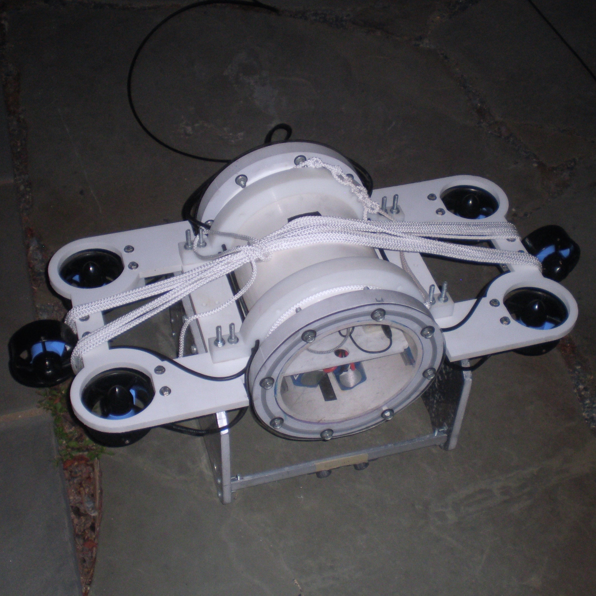
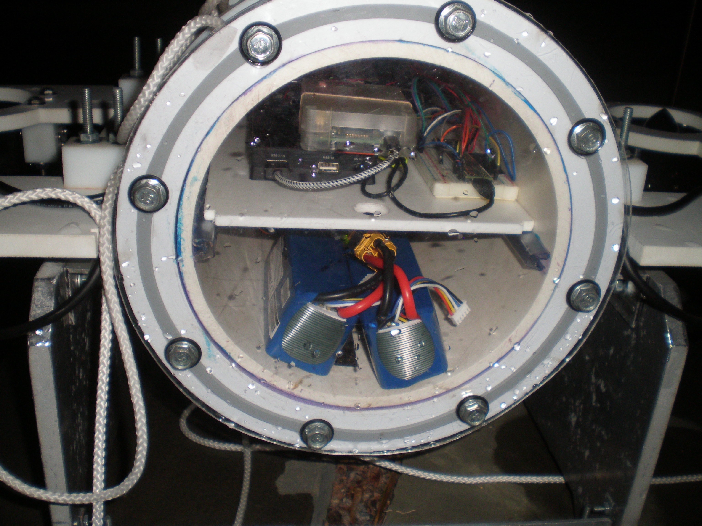
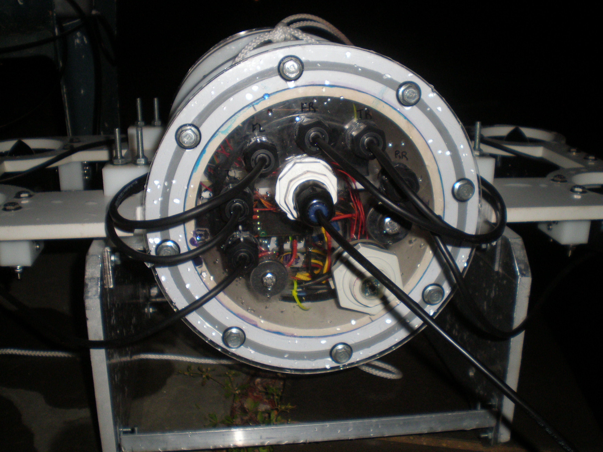
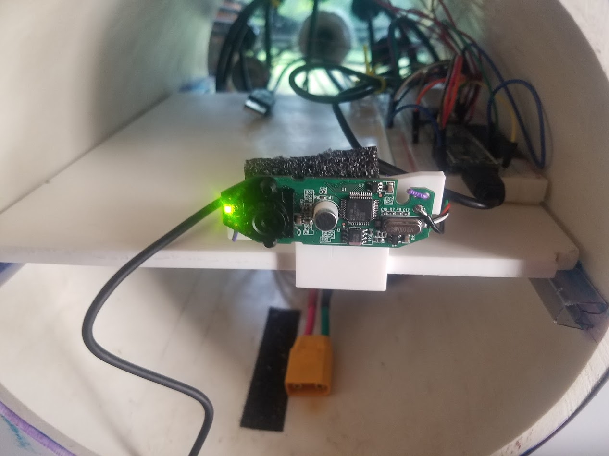
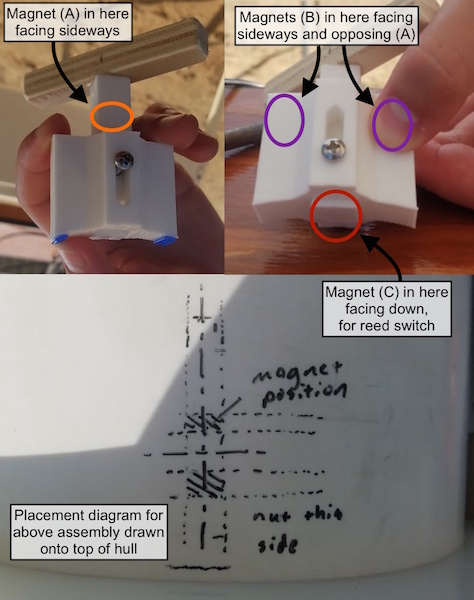

*This page will provide an overview of the most recent version of a sub, while the blog will provide the history of its creation.*

# 2019

*Last Updated June 8th, 2019*

We have a confession... The mechanical design for the 2019 sub isn't done yet. We're in the process of converting sketches from our team of talented artists (hehe) into rough CAD drawings, which will be posted here as soon as they're available.

# 2018

## Orca v1

*Last Updated June 8th, 2019*

Although an early picture lacking several of the features implemented for competition, this is probably the best picture we have of Orca.

Here are closeups from the front and back:

The batteries are located in the bottom section, the motor drivers at the rear, and the rest of the electronics (including a separate power supply) on a plastic plate.

Note the modified ethernet cable gland and the custom depth sensor.

**Processing and Sensors:**

* Raspberry Pi 3B
* Teensy 3.5 Arduino-Compatible (120 MHz)
* BNO055 9-axis IMU w/ onboard fusion
* MS5803 (5 bar) absolute pressure sensor
* 100 Mbit Ethernet

**Power:**

* 6x Blue Robotics T100 thrusters
* 2x 4200 mAh LiFePo4 Batteries (parallel)

**Frame:**

* PVC main hull
* Polycarbonate front and rear plate
* Delrin(?) wings
* Stainless steel ballast plates

***

Additional features added before competition included:

* 3D-printed camera mount for Logitech C270 webcam

* Kill switch (pull -> disable)

The external assembly is somewhat unique in that it uses the force experienced by opposing poles of a magnet to keep the plunger at either the Up or Down position. Magnets were embedded in the holder and plunger in such a way that a maximum of sideways force was experienced when the plunger was halfway down. The field forces were sufficient to hold the plunger up (Power off), or keep it pressed tightly to the hull (Power on). The plunger had an additional magnet at the bottom to affect a reed switch directly below it inside the hull.

The internal assembly (not shown) was a simple reed switch and heavy duty transistor combination in line with the batteries. This part of the assembly was built in the hotel during the competition week with copper clad, a box cutter, and a soldering iron. Only 1 reed switch was harmed in the making of this part.